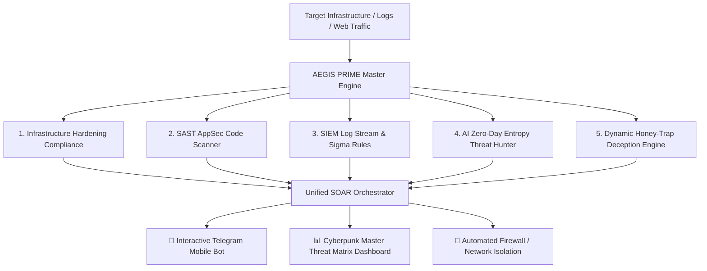

# 🛡️ PROJECT AEGIS PRIME - Unified Autonomous SOC & Cyber Defense Master Platform


## 📌 Executive Summary
**Project Aegis Prime** is the **Crown Jewel Master Platform** of this cybersecurity portfolio. It unifies all 7 defensive disciplines (Infrastructure Hardening, AppSec, SIEM Log Analysis, Interactive Mobile SOAR, Executive Vulnerability Scanning, Honeypot Intelligence, and AI Zero-Day Entropy Detection) into a single, fully autonomous **Master Cyber Defense Command Center**.

---

## 🏛️ Master Architecture Diagram



---

## 🎯 Unified Master Capabilities

| Defense Layer | Engine Module | Standards Compliance | Automated Action |
| :--- | :--- | :--- | :--- |
| **System Hardening** | OS / NGINX / Docker | CIS Linux & Docker Benchmarks | Audit status & sysctl enforcement |
| **AppSec & DevSecOps** | SAST Scanner & Rule Checker | OWASP Top 10 / CWE Matrix | Parameterized query validation & CI/CD gate |
| **SIEM & Logs** | Sigma & Wazuh Rule Engine | MITRE ATT&CK Framework | Real-time SSH & Web attack correlation |
| **AI Threat Hunting** | Shannon Entropy Calculator | Zero-Day Obfuscation Hunter | Obfuscated shellcode & payload detection |
| **Deception Engineering** | Decoy Tokens & Trap Endpoints | Honey-Trap Deception | Instant IP ban on trap access |
| **Mobile SOAR** | Interactive Bot (Telegram API) | NIST SP 800-61 Incident Response | Mobile buttons: `[🛑 Bloquear IP]` / `[🔌 Aislar]` |
| **Reporting & BI** | Master Dashboard Generator | Executive Reporting | Interactive HTML Command Center Dashboard |

---

## 📁 Repository Structure

```
project-aegis-prime-master-soc/
├── README.md                           # Master Architecture Documentation
├── core/
│   └── aegis_master_engine.py          # Unified Master Orchestration Engine
├── dashboard/
│   └── generate_master_dashboard.py    # 3D Cyberpunk Master Command Center Generator
└── reports/
    └── aegis_master_report.html        # Exported Master Security Dashboard
```

---

## 🧪 Local Execution & Master Verification

Run the Unified Aegis Prime Master SOC Platform:

```bash
# 1. Run the Aegis Prime Master Unified Defense Engine
python core/aegis_master_engine.py

# 2. Generate and View the Master Command Center HTML Dashboard
python dashboard/generate_master_dashboard.py
```

---

## 👨‍💻 Author & Contact
* **Portfolio Masterpiece by:** EMR (Autonomous SOC Architect & Security Engineer)
* **LinkedIn:** [Tu Perfil de LinkedIn]
* **GitHub:** [@tu-usuario-github]
